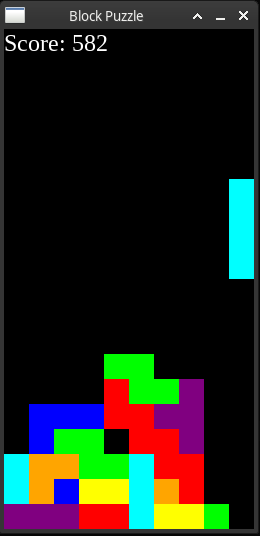

===================
Pyglet Block Puzzle
===================

Block puzzle game made using Pyglet.

How to run
----------
Clone the project and install dependencies

.. code-block:: bash

    python setup.py install

Run the main module

.. code-block:: bash

    python -m pyglet_block_puzzle.main

Credits
-------

This package was created with Cookiecutter_ and the `audreyr/cookiecutter-pypackage`_ project template.

.. _Cookiecutter: https://github.com/audreyr/cookiecutter
.. _`audreyr/cookiecutter-pypackage`: https://github.com/audreyr/cookiecutter-pypackage
